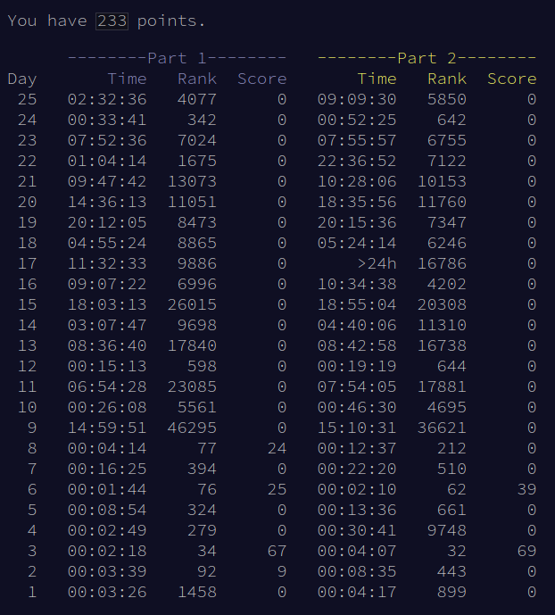
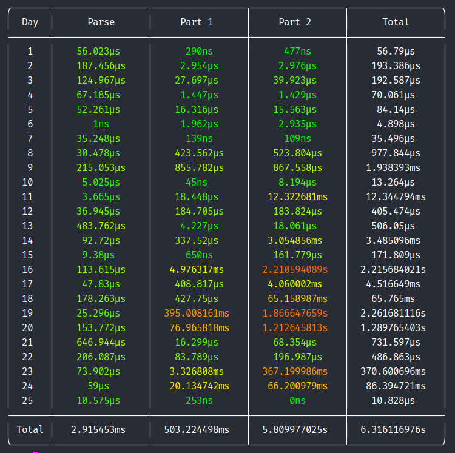

# aoc22

Advent of code solutions 2022. This repository contains two sets of solutions:
one written in Python, and one written in Rust.

The Python solutions are the ones I initially used to solve the puzzles, and (with
the exception of day 17 part 2), they were all written on the day of the puzzle
release. The Python solutions are fully automated - they will fetch the input data
and submit a solution automatically.

To run the Python solutions, install the dependencies from `aoc22_py/requirements.txt`,
then run `python -m aoc22_py all`.

The Rust solutions were all written after the end of Advent of Code, with the aim
of bringing the total execution time as low as possible. They also come with an
automated runner, which tests the solutions against my puzzle input data and
solutions, and measures the execution time.

To run the Rust solutions, go to `aoc22_rs` and run `cargo run --release`.

## Scores

Puzzles release at 5am in my time, so I often don't get to them until later.



<details>
<summary>Plain text</summary>

> You have 233 points.
>
> ```
>       --------Part 1--------   --------Part 2--------
> Day       Time   Rank  Score       Time   Rank  Score
>  25   02:32:36   4077      0   09:09:30   5850      0
>  24   00:33:41    342      0   00:52:25    642      0
>  23   07:52:36   7024      0   07:55:57   6755      0
>  22   01:04:14   1675      0   22:36:52   7122      0
>  21   09:47:42  13073      0   10:28:06  10153      0
>  20   14:36:13  11051      0   18:35:56  11760      0
>  19   20:12:05   8473      0   20:15:36   7347      0
>  18   04:55:24   8865      0   05:24:14   6246      0
>  17   11:32:33   9886      0       >24h  16786      0
>  16   09:07:22   6996      0   10:34:38   4202      0
>  15   18:03:13  26015      0   18:55:04  20308      0
>  14   03:07:47   9698      0   04:40:06  11310      0
>  13   08:36:40  17840      0   08:42:58  16738      0
>  12   00:15:13    598      0   00:19:19    644      0
>  11   06:54:28  23085      0   07:54:05  17881      0
>  10   00:26:08   5561      0   00:46:30   4695      0
>   9   14:59:51  46295      0   15:10:31  36621      0
>   8   00:04:14     77     24   00:12:37    212      0
>   7   00:16:25    394      0   00:22:20    510      0
>   6   00:01:44     76     25   00:02:10     62     39
>   5   00:08:54    324      0   00:13:36    661      0
>   4   00:02:49    279      0   00:30:41   9748      0
>   3   00:02:18     34     67   00:04:07     32     69
>   2   00:03:39     92      9   00:08:35    443      0
>   1   00:03:26   1458      0   00:04:17    899      0
> ```
</details>

## Rust timings

Timings are measured in release mode on my laptop, a ThinkPad T460 with an i7-6600U CPU and 16GB RAM.



<details>
<summary>Plain text</summary>

| Day   | Parse     | Part 1        | Part 2       | Total        |
|:-----:|:---------:|:-------------:|:------------:|:------------:|
| 1     | 56.023µs  | 290ns         | 477ns        | 56.79µs      |
| 2     | 187.456µs | 2.954µs       | 2.976µs      | 193.386µs    |
| 3     | 124.967µs | 27.697µs      | 39.923µs     | 192.587µs    |
| 4     | 67.185µs  | 1.447µs       | 1.429µs      | 70.061µs     |
| 5     | 52.261µs  | 16.316µs      | 15.563µs     | 84.14µs      |
| 6     | 1ns       | 1.962µs       | 2.935µs      | 4.898µs      |
| 7     | 35.248µs  | 139ns         | 109ns        | 35.496µs     |
| 8     | 30.478µs  | 423.562µs     | 523.804µs    | 977.844µs    |
| 9     | 215.053µs | 855.782µs     | 867.558µs    | 1.938393ms   |
| 10    | 5.025µs   | 45ns          | 8.194µs      | 13.264µs     |
| 11    | 3.665µs   | 18.448µs      | 12.322681ms  | 12.344794ms  |
| 12    | 36.945µs  | 184.705µs     | 183.824µs    | 405.474µs    |
| 13    | 483.762µs | 4.227µs       | 18.061µs     | 506.05µs     |
| 14    | 92.72µs   | 337.52µs      | 3.054856ms   | 3.485096ms   |
| 15    | 9.38µs    | 650ns         | 161.779µs    | 171.809µs    |
| 16    | 113.615µs | 4.976317ms    | 2.210594089s | 2.215684021s |
| 17    | 47.83µs   | 408.817µs     | 4.060002ms   | 4.516649ms   |
| 18    | 178.263µs | 427.75µs      | 65.158987ms  | 65.765ms     |
| 19    | 25.296µs  | 395.008161ms  | 1.866647659s | 2.261681116s |
| 20    | 153.772µs | 76.965818ms   | 1.212645813s | 1.289765403s |
| 21    | 646.944µs | 16.299µs      | 68.354µs     | 731.597µs    |
| 22    | 206.087µs | 83.789µs      | 196.987µs    | 486.863µs    |
| 23    | 73.902µs  | 3.326808ms    | 367.199986ms | 370.600696ms |
| 24    | 59µs      | 20.134742ms   | 66.200979ms  | 86.394721ms  |
| 25    | 10.575µs  | 253ns         | 0ns          | 10.828µs     |
|       |           |               |              |              |
| Total | 2.915453ms| 503.224498ms  | 5.809977025s | 6.316116976s |

</details>
